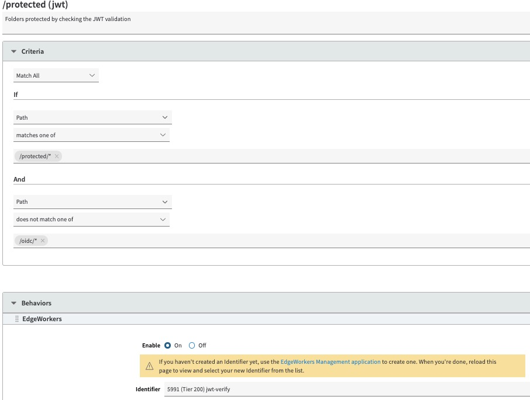
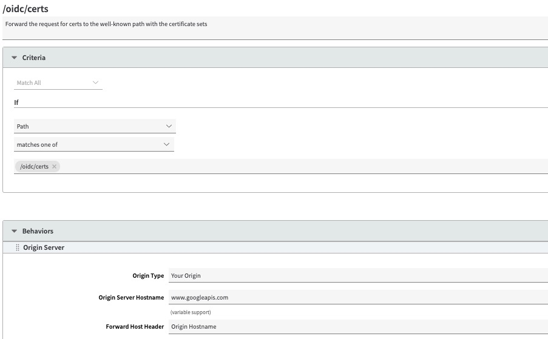
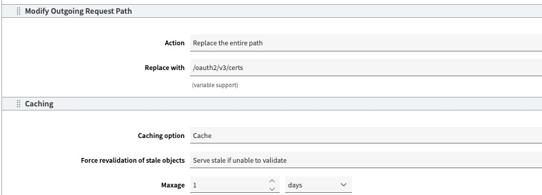

# JWKS - Configure application in property manager

## Required setup

Within the property manager a number of rules and behaviors need to be added:
- JWT verification, a rule to verify the JSON Web Token using the Edgeworker
- Certificate request, a rule to fetch the certificate set and cache it

## JWT verification
A new rule will need to be added to your existing Property Manager property to enforce token authentication

1. Create a rule called "/protected/". Add match conditions to include all protected folders and exclude the /oidc/ folder
2. Add the behavior to validate the JWT using the Edgeworker

## Certificates request
1. Create a rule called /oidc/certs. 
  - IF PATH matches /oidc/certs
    - Caching 1 day
    - Origin: www.googleapis.com
    - Request path: /oauth2/v3/certs

...

