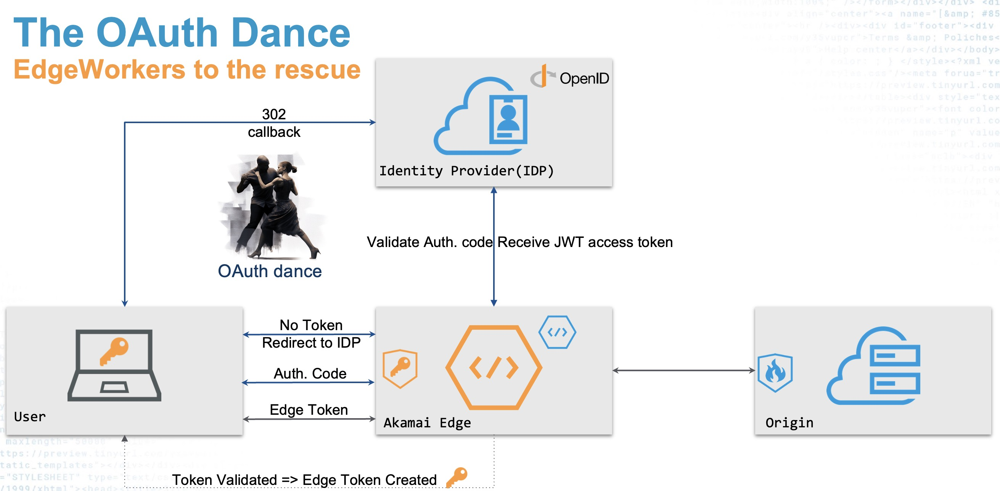

# OpenID Connect at the Akamai Edge

**DISCLAIMER: This code is designed to be used as an example only. No guarantees are made that it's fit for purpose. It's not production ready and should not be used to protect critical resources**

This EdgeWorker is designed to protect an Akamaized site using OpenID Connect (OIDC) in combination with token protection. 

## Basic idea
The basic idea is that the website is protected using a token which is stored in a cookie.

- If the token is valid and not expired, the Akamai Configuration will serve the content from cache or from origin. 
- If the token is not available or expired, the "Invalid Token" flow will be followed. After successful authentication by your IdP, an Akamai Authentication token is sent as a cookie to your browser. 

The token can be a standard Akamai Token or the JWT token as provided by the IDP.
- An Akamai Token is a token signed using HMAC-SHA256 which is valid for a limited time. [Akamai Token 2 Verification](https://techdocs.akamai.com/property-mgr/docs/auth-token-2-0-ver) is a standard behavior of the [Akamai Property Manager](https://techdocs.akamai.com/property-mgr/docs).
- A JWT token needs can be validated using an EdgeWorker. Example code [JWT validation using JWKS](https://github.com/ericdebeij/edgeworker-examples/jwks).

_In the setup of this example an Akamai Token is used. The Edgeworker will generate both an EdgeToken (\_\_token\_\_ as well as a JSON Web Token \_\_jwt\_\_)_

## How to setup
Setup requires configurations at multiple places:
- An OpenID Connect Identity Provider, for example Google or Azure
  - [Google setup](google.md) - Instructions for setting up Google IDP
- [OIDC Edgeworker](edgeworker.md) - The responseProvider in Javascript
- [Property Manager](propertymanager.md) - This includes validation of the token, redirect to the OIDC edgeworker and proxy to the IDP token endpoint

## The flow
1. User tries to access a protected url without a valid token
2. Akamai configuration redirects the browser to the EdgeWorker login routine to start the OIDC login
3. Edgeworker stores temporary information in cookies and redirects the browser to the IDP
4. User logs in at the IDP and provides consent to share information with the application
5. IDP redirects the browser to the EdgeWorker callback routine to complete the OIDC code flow
6. Edgeworker verifies the received code at the IDP
7. Edgeworker generates the Akamai Token
8. Edgeworker redirects the browser back to the protected url
9. Akamai configuration validate the token and serves the content from cache or origin

## Known Limitations
Not implemented yet, amongs others:
- Other IDP providers (tested with Google)
- Generate and check the anti-forgery state token
- More fine-grained authorization

## Credits
Thanks Ian Cass for your contributions! Ian Cass variations can be found at