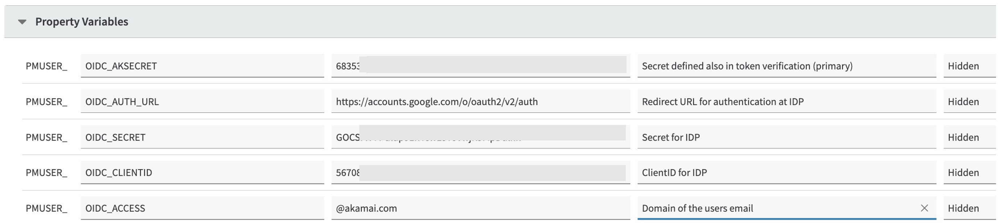
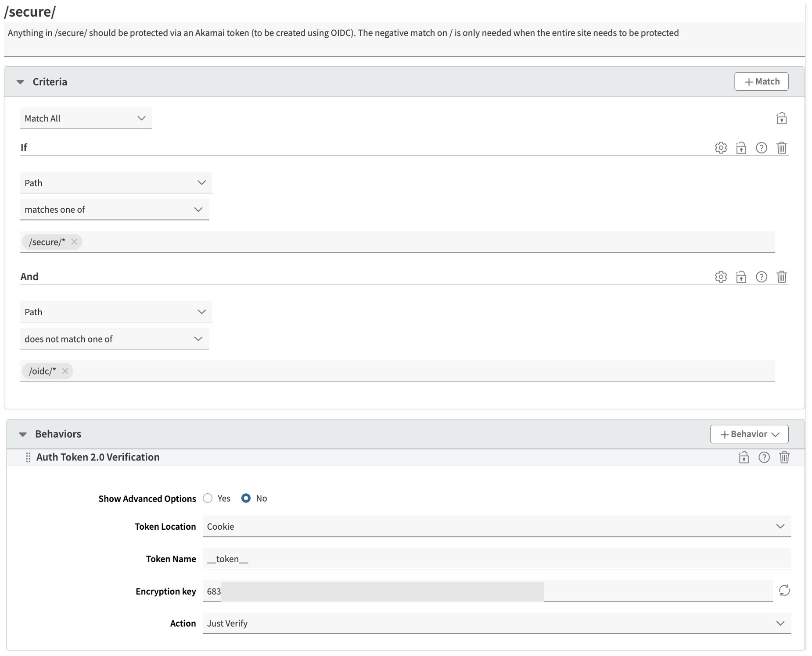
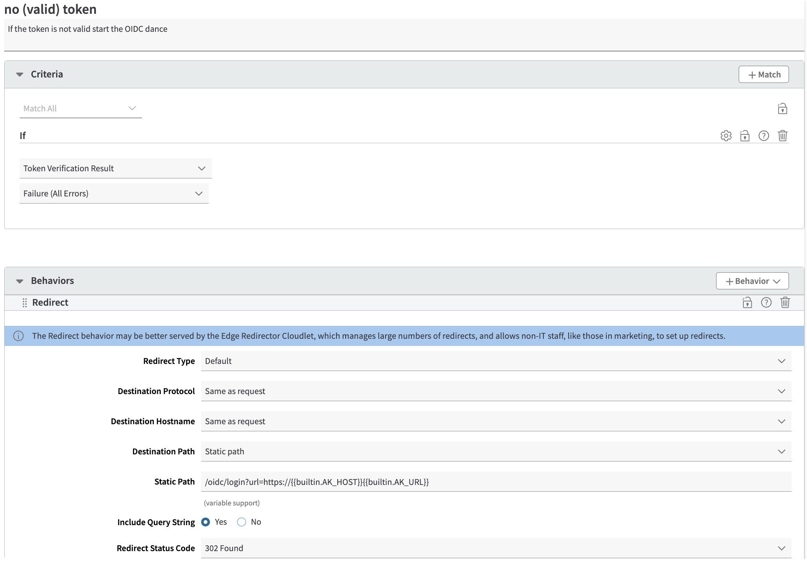
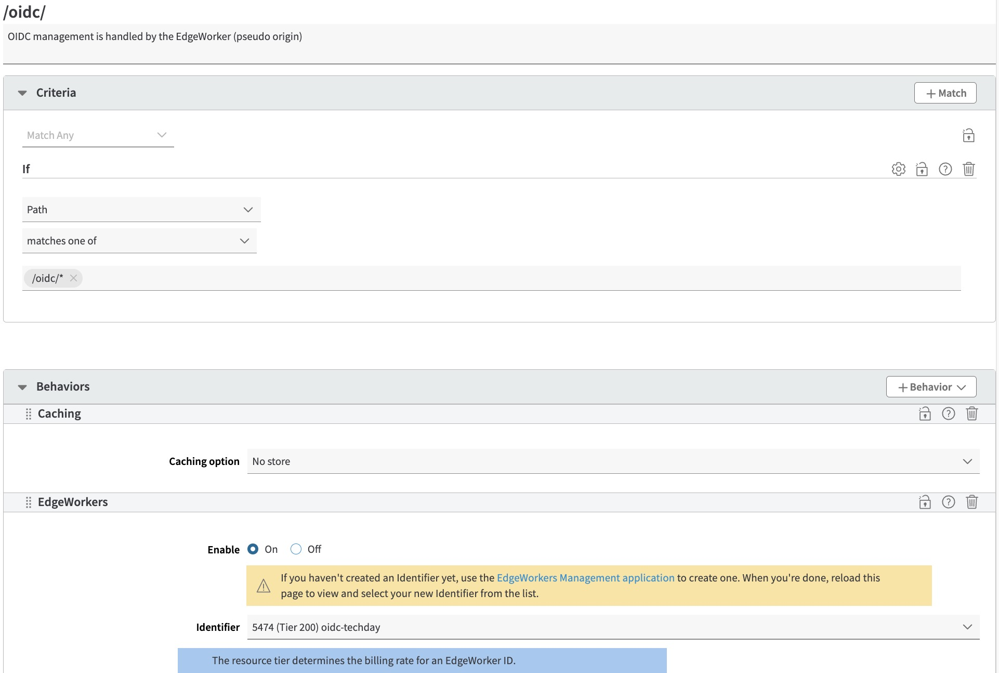

# OIDC - Configure application in property manager

## Required setup
Within the property manager a number of rules and behaviors need to be added:
- Variables, sset of variables, these are used as parameters for the OIDC configuration
- Token verification, a rule to verify the token and initiate the login process when the token is not valid
- Edgeworker, a rule to serve the edgeworker on the /oidc/ path
- IDP Token, a rule to proxy to the token endpoint

## Variables
Property Manager Variables are required to be added in order to share the required credentials with the EdgeWorker. These should be configured as "hidden". 
Notes:
Do not set these to "sensitive" or the Edge Worker will not be able to access them. 
Do not leave them as "visible" or anyone can view them using Akamai Debug Headers

1. OIDC_AKSECRET - The same key as contained in the Akamai "Token Authentication" behaviour. Copy/paste it here.
2. OIDC_CLIENTID - The client id as generated by the OpenID provider
3. OIDC_SECRET - The secret as generated by the OpenID provider
4. OIDC_AUTH_URL - The full url for authentication with the IdP (see section above)
5. OIDC_ACCESS - Identify domain that is allowed to access

## Token verification
A new rule will need to be added to your existing Property Manager property to enforce token authentication and to redirect to the login site if there's no valid token

1. Create a rule called "/secure/". Add match conditions to include all protected folders and exclude the /oidc/ folder

2. Create a child rule of "Token Validation" called "No (valid) token"
   - IF NOT valid token
      - Redirect /oidc/login?url=https://{{builtin.AK_HOST}}{{builtin.AK_URL}}

## Edgeworker
1. Create a rule called /oidc/. 
  - IF PATH matches /oidc/*
    - Caching no-store
    - Edgeworker

## IPD Token
Check the [wellknown](https://accounts.google.com/.well-known/openid-configuration) of the IDP provider for the token endpoint

1. Create a rule called /oidc/token
- IF PATH matches /oidc/token
  - Caching no-store
  - Path override to /token
  - Origin server IDP hostname, forward host header origin hostname

## New Property Manager Property for Login Site
A new Property Manager configuration will need to be set up for the Login site. You can use Netstorage as the origin serving a placeholder home page. You'll also need to create a new certificate for this site in Akamai Control Panel.

Other than the basic configuration, you'll need to add specific configuraton as described below.

### Rules
Property Manager should be configured like so:-

1. Create an empty rule called "Edgeworker"
   - IF path matches /oidc/*
      - Edgeworkers behaviour
      - Allow POST
      - Cache Rule = no-store (important to make sure Set-Cookie gets returned)

2. Create a child rule of "Authentication" called "OpenID Token Validation". This rule needs to exist because the Edgeworker cannot talk directly to your OpenID provider so the token validation requests need to proxy through Akamai. We therefore treat the OpenID Provider as an origin for any requests that are made to /oidc/token
   - IF path matches /oidc/token
     - Origin behaviour = Hostname = <token hostname>, Forward Host Header = origin hostname
     - Path overriden to OIDC_TOKEN_PATH
 
 
